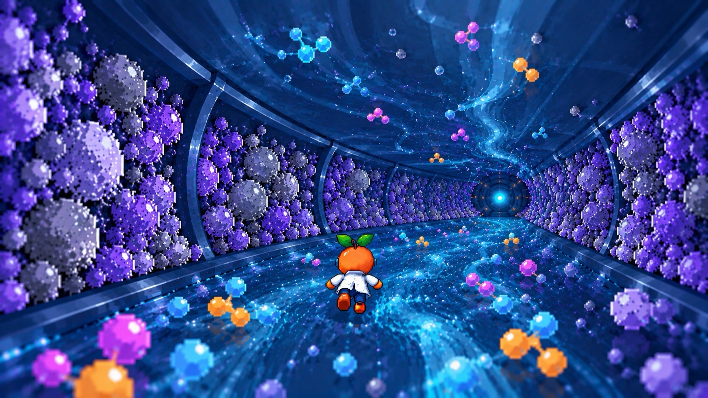

# ChromaRacers — Visual Target: Chromatographic Column

> **Purpose:** This document translates the supplied reference image into an actionable visual specification for Cursor/code generation.
>
> **Important:** The reference image is the **visual target**, not a literal instruction to copy every pixel. Preserve the composition, depth, atmosphere, color language and gameplay readability while adapting the scene to the actual ChromaRacers game.



---

## 1. Core Visual Concept

The player is racing **inside a giant chromatographic column**.

The camera looks **forward through the column**, creating a strong tunnel perspective. The chromatographic stationary phase forms the walls, while the mobile phase flows along the central path.

The intended visual impression is:

- futuristic scientific environment;
- recognizable chromatography laboratory concept;
- arcade game rather than scientific simulation;
- vibrant blue/cyan mobile phase;
- purple/indigo stationary phase;
- colorful analyte molecules moving through the column;
- pixel-art character rendered against a rich 3D environment;
- strong sense of speed and depth.

### Visual hierarchy

The player must immediately perceive:

1. **Character / racer**
2. **Race path and direction**
3. **Chromatographic column**
4. **Flow / mobile phase**
5. **Stationary phase**
6. **Molecules / obstacles / collectibles**
7. **Tunnel depth and finish direction**

Do not allow particles, lighting or background decoration to overpower the racer.

---

# 2. Camera

## Master Camera Rule

**The gameplay camera is positioned behind the player character and looks forward through the chromatographic column.**

The camera should behave like a third-person arcade racing camera.

### Camera characteristics

- Position: behind and slightly above the player.
- Looking direction: forward along the column axis.
- Perspective: strong perspective projection.
- Field of view: moderately wide.
- Player remains close to the lower-middle region of the screen.
- Vanishing point is approximately centered horizontally.
- Column walls converge toward the distance.
- The camera follows forward movement smoothly.
- Avoid an orthographic or flat side-scrolling appearance.

### Desired composition

The image should communicate:

```text
                 FAR END / VANISHING POINT
                         ●
                       /   \
                     /       \
                   /           \
                 /               \
               /                   \
             /                     \
           /                       \
         /                         \
       PLAYER
```

The player should occupy roughly the lower-middle portion of the frame.

---

# 3. Chromatographic Column

The environment is a **large cylindrical chromatographic column** transformed into an arcade-racing tunnel.

## Structural elements

Create:

- cylindrical outer wall;
- repeated structural rings;
- transparent / semi-transparent upper wall;
- dense stationary-phase material along the walls;
- central mobile-phase race channel;
- distant circular outlet/end of the column;
- subtle metallic/technical structural details.

### Column geometry

The column should feel much larger than the character.

The player should not appear to be inside a small pipe.

Recommended proportions:

- Character height: approximately 1 game unit.
- Internal column diameter: approximately 8–12 character heights.
- Race path width: approximately 3–5 character widths.
- Structural rings repeated along the depth axis.

### Structural rings

Use repeated curved support rings.

They should:

- become smaller toward the vanishing point;
- reinforce perspective;
- create a sense of continuous depth;
- remain visually subordinate to the racer.

Do not make the rings look like generic sci-fi spaceship architecture. They should retain a **laboratory/chromatography** identity.

---

# 4. Stationary Phase

The walls are covered with dense chromatographic stationary-phase particles.

## Visual language

Primary appearance:

- purple;
- violet;
- indigo;
- lavender;
- occasional gray/blue particles.

The stationary phase should look like a dense packed-bed material rather than trees, rocks or crystals.

### Particle characteristics

Particles should be:

- irregular;
- rounded;
- porous-looking;
- clustered;
- different sizes;
- densely packed;
- slightly luminous from environmental lighting.

Avoid:

- perfect spheres;
- identical repeated particles;
- large rocks;
- obvious gemstones;
- vegetation-like shapes.

### Depth behavior

Near the camera:

- larger particles;
- stronger detail;
- stronger contrast.

Far from the camera:

- smaller particles;
- lower detail;
- more atmospheric blue/purple haze.

This creates a natural depth gradient.

---

# 5. Mobile Phase / Race Surface

The floor is the **mobile phase** and also the primary racing surface.

It should look like a fast-moving liquid stream.

## Color

Dominant:

- deep blue;
- electric blue;
- cyan;
- turquoise highlights.

## Motion

The surface should communicate forward movement using:

- flowing streaks;
- directional ripples;
- particle trails;
- subtle wave deformation;
- animated texture;
- bright cyan highlights.

The flow should converge toward the vanishing point.

### Important

The flow direction must always reinforce the player's forward direction.

Avoid random swirling that makes the race direction unclear.

---

# 6. Analyte Molecules

Colorful molecules travel through the column.

These represent compounds moving through the chromatographic system.

## Molecule colors

Use a limited palette:

- cyan;
- blue;
- magenta;
- pink;
- orange;
- yellow;
- violet.

Each molecule can consist of:

- 2–5 connected nodes;
- small glowing bonds;
- pixel-art or low-poly appearance;
- subtle bloom/glow.

### Molecule behavior

Molecules should:

- move through the column;
- follow the mobile-phase direction;
- have different velocities;
- occasionally cross the player's path;
- function as gameplay objects where appropriate.

### Important gameplay distinction

Not every molecule should be an obstacle.

Potential object categories:

```text
COLLECTIBLE
    ↓
colored analyte / bonus

OBSTACLE
    ↓
dense particle cluster / contaminant

BOOST
    ↓
high-energy analyte

QUIZ / KNOWLEDGE OBJECT
    ↓
chromatography-related molecule/icon
```

The visual appearance of each category must be distinguishable during gameplay.

---

# 7. Player Character

The character is a **small pixel-art scientific racer**.

The reference composition uses an orange/red fruit-like character wearing a white laboratory coat.

For ChromaRacers, preserve the concept:

- compact pixel-art body;
- white lab coat;
- scientific identity;
- visible legs/feet;
- readable silhouette;
- character centered near the lower-middle of the screen.

## Character requirements

The character must remain readable against the blue mobile phase.

Use:

- strong silhouette;
- dark outline;
- limited but saturated colors;
- animation with clear running/flying/racing motion.

### Scale

The player should be large enough to identify immediately but small enough to preserve the environment.

Target:

**Character occupies approximately 8–14% of screen height.**

Do not make the character enormous.

---

# 8. Pixel-Art Integration

The environment may be 3D/high-detail, but the player and gameplay objects should retain a coherent retro-game identity.

Preferred aesthetic:

**16-bit / PS1-inspired arcade science fiction.**

### Pixel-art rules

- hard silhouettes;
- limited palette;
- visible pixel clusters;
- no photographic textures;
- avoid overly smooth vector-like characters;
- avoid modern mobile-game cartoon rendering.

The 3D environment can use low-poly geometry + stylized textures to bridge the visual styles.

---

# 9. Lighting

Lighting is one of the most important elements.

## Primary lighting

Dominant environmental illumination:

- blue;
- cyan;
- violet.

## Secondary lighting

Use colored emissive accents from:

- molecules;
- mobile phase;
- distant column end;
- equipment structures.

### Distant light

At the far end of the column, place a small bright circular cyan light.

It acts as the visual destination / vanishing-point anchor.

It should not look like a sun.

It should look like:

- detector;
- column outlet;
- energized chromatographic detector;
- race destination.

---

# 10. Atmospheric Depth

Add subtle volumetric/atmospheric effects.

Near camera:

- strong contrast;
- sharp particles;
- strong flow details.

Mid-distance:

- moderate contrast;
- softer particles.

Far distance:

- blue haze;
- reduced contrast;
- bright cyan center.

This should produce:

**foreground → midground → background**

without requiring excessive geometry.

---

# 11. Color Palette

Use this as a starting palette, not a rigid requirement.

```text
MOBILE PHASE
#0066CC
#00AEEF
#19D9FF
#0050A8

STATIONARY PHASE
#321B72
#5120A8
#7138D4
#9B7BE8

MOLECULE ACCENTS
#00D9FF
#FF4FD8
#FF9F1C
#FFD166
#A855F7

STRUCTURE
#102B55
#183B67
#284C78

LIGHT
#6FEAFF
```

Avoid excessive green.

Avoid purple UI elements becoming dominant.

Purple should primarily communicate the stationary phase, while cyan/blue communicates the mobile phase.

---

# 12. Scene Composition

The target composition can be described as:

```text
┌───────────────────────────────────────────────┐
│                                               │
│        TRANSPARENT / FLOWING CEILING          │
│                                               │
│   PURPLE STATIONARY PHASE      STATIONARY    │
│   ████████████████             ███████████   │
│   ████████████████             ███████████   │
│        \                           /          │
│         \                         /           │
│          \       MOLECULES       /            │
│           \       ↓ ↓ ↓         /             │
│            \                   /              │
│             \      ●         /               │
│              \              /                │
│               \            /                 │
│                \          /                  │
│                 \        /                   │
│                  PLAYER                      │
│                                               │
│             BLUE MOBILE PHASE                │
│          flowing toward distance              │
└───────────────────────────────────────────────┘
```

---

# 13. What Cursor Should NOT Do

Do not implement the reference as:

- a flat 2D background;
- a generic spaceship corridor;
- a generic underwater tunnel;
- a generic crystal cave;
- a normal road;
- a side-scrolling platform;
- a purple-only fantasy environment;
- a random particle tunnel.

The environment must visibly communicate:

**CHROMATOGRAPHIC COLUMN + RACING GAME**

---

# 14. Gameplay Readability

Visual quality must not compromise gameplay.

At any moment the player should understand:

- where the character is;
- where the race path is;
- what is collectible;
- what is dangerous;
- where the column continues;
- which direction is forward.

Use visual hierarchy rather than adding more effects.

If an effect makes the player difficult to see, reduce the effect.

---

# 15. Technical Implementation Direction

Assume a real-time 3D scene.

Recommended conceptual structure:

```text
ChromaracersScene
│
├── ColumnEnvironment
│   ├── ColumnShell
│   ├── StructuralRings
│   ├── StationaryPhase
│   └── DistantDetector
│
├── RaceSurface
│   ├── MobilePhase
│   ├── FlowTexture
│   └── FlowParticles
│
├── GameplayObjects
│   ├── AnalyteMolecules
│   ├── Obstacles
│   ├── Collectibles
│   └── Boosters
│
├── Player
│   ├── Sprite / SpriteSheet
│   ├── AnimationController
│   └── CollisionBody
│
├── Camera
│   └── ThirdPersonFollowCamera
│
└── Lighting
    ├── BlueEnvironmentLight
    ├── CyanEmissiveLight
    └── PurpleAmbientLight
```

---

# 16. Performance Rules

The scene should look visually rich without creating unnecessary geometry.

Prefer:

- instanced particles;
- sprite/particle systems;
- repeated textures;
- low-poly geometry;
- emissive materials;
- shader-based flow;
- object pooling for molecules;
- distance-based detail reduction.

Avoid creating thousands of independent high-poly meshes.

---

# 17. Cursor Execution Instructions

When implementing this visual target:

### Phase 1 — Composition

First reproduce only:

1. cylindrical column;
2. camera perspective;
3. stationary-phase walls;
4. blue mobile-phase floor;
5. distant cyan detector;
6. player position.

Do not add decorative particles yet.

### Phase 2 — Materials

Add:

1. purple stationary phase;
2. blue/cyan mobile phase;
3. metallic structural rings;
4. emissive distant detector.

### Phase 3 — Motion

Add:

1. forward camera movement;
2. mobile-phase flow;
3. environmental particle motion;
4. player locomotion.

### Phase 4 — Gameplay Objects

Add:

1. analyte molecules;
2. collectibles;
3. obstacles;
4. boosters.

### Phase 5 — Polish

Finally add:

1. bloom/glow;
2. atmospheric depth;
3. particle density variation;
4. subtle screen effects;
5. additional environmental detail.

Do not attempt all effects at once.

---

# 18. Acceptance Criteria

The implementation is visually successful only if a screenshot can be shown to someone unfamiliar with the project and they can reasonably infer:

> "This is a character racing through the inside of a chromatographic column."

The scene should also clearly resemble the supplied reference in:

- camera perspective;
- tunnel depth;
- blue/cyan flow;
- purple packed stationary phase;
- colorful molecules;
- central player composition;
- futuristic scientific atmosphere.

---

# 19. Reference Image

The original visual reference is stored next to this document as:

`reference_chromaracers_column.jpg`

Use it during implementation as the **art-direction reference**.

Do not use the image as a flat background unless explicitly requested. The objective is to reconstruct the visual language as an actual interactive game environment.
